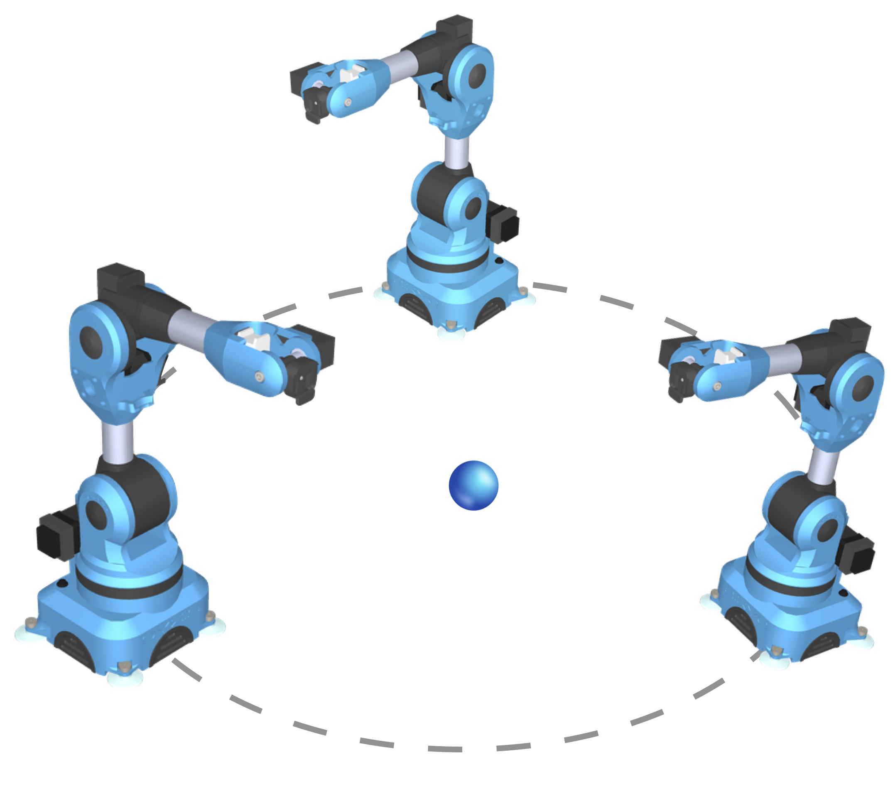

## Animate a robot arm using inverse kinematics

### Overview

In your previous assignment, you created a robot arm that resembles the one shown in Figure 1. In this assignment, you will use inverse kinematics to animate your robot arm. In the animation, the robot’s end effector should move from a *starting position* to a *goal position*. The path of the robot-arm motion should be calculated using inverse kinematics. 

​								**Figure 1**: Robot arm and measurements. 

Use *Vedo* (`https://vedo.embl.es`) for rendering the graphics of the animation. The animation consists of three robots positioned equidistantly on a circumference. Each robot will start at a different pose (i.e., different starting points for each end effector) and then move to touch a small sphere positioned at the center of the circle (i.e., the sphere is the goal position). Figure 2 shows an example of the placement of the robots for the animation. You will select the radius of the circle that fits your animation. 

**Figure 2**: Placement of the robot arms for the animation. Three robots placed at equidistant points along a circumference. Robots should try to touch the sphere (i.e., the goal position).

For this animation, the last part (i.e., the blue grasp-like attachment at the end of the arm connected to the gray cylinder) does not need to rotate (i.e., the coordinate frame of the end effector will be aligned with the coordinate frame of the previous joint. 

### Implementation details

- Implement the gradient descent solution explicitly by extending the code in the example from the following notebook: https://github.com/eraldoribeiro/gradientDescent/blob/main/gradientDescent2DVectorsJacobian.ipynb

- You must write the gradient-descent solution explicitly. Do not use an optimization function from a library, e.g., `scipy.optimize.fsolve()`. 

- You must write the function of the Jacobian-approximation function explicitly. Here, you can extend the function  `JacobianApprox(x, function, dx, dy)` in the example notebook. 

- The animation should show the path of the end effectors. To do that in Vedo, use the 

  function `.add_trail()`. See code named *airplanes* in the Animation examples here: https://vedo.embl.es

- Create a video (or videos) of the animation(s) and make sure you add a link to the video file in the `README.md` file. 

  ### Suggestions on how to complete the assignment

  1. **Make sure your implementation of the previous animation assignment works**. Specifically, you will need the forward kinematics function to work correctly because you will need to use it for the calculations needed to obtain the approximation of the Jacobian matrix. 

  2. **Understand the problem and solution as much as possible prior to start coding**. This means studying the related notes and materials provided. Do you mean actually studying the related materials? Yes! Unsurprisingly, having a good understanding of the problem and its solution helps minimize confusion while maximizing correctness of the code. Links to the related course materials are as follows:
     - [Basics of inverse kinematics](https://htmlpreview.github.io/?https://github.com/eraldoribeiro/inverse_kinematics_basic/blob/main/invKinematics_basic.html)

  4. **Prototype the simplest case then upgrade**. Start by obtaining a solution for the simplest joint-angle configuration possible then upgrade the solution to more joint angles. The initial configuration can be just moving a single joint angle of your current robot arm (fix everything else). Another good option is to solve the inverse kinematics for two joint angles only. I think solving for two joint angles is a very good option to start because you can directly adapt the solution provided for the vector field example (shown in class) which is already written here:  https://github.com/eraldoribeiro/gradientDescent/blob/main/gradientDescent2DVectorsJacobian.ipynb. The analogy is straightforward if you assume that your robot arm changes only two joint angles (e.g., $\phi_2$ and $\phi_3$) and its end effector moves only on a single plane, e.g., it will move only the $(x, z)$ spatial dimensions. With these restriction, the solution provided by the vector field example maps (almost) directly to the inverse-kinematics solution. The function in the vector field example is ${\bf u}({\bf x})$ where ${\bf x} = (x,y)^\mathsf{T}$ and ${\bf u} = (u,v)^\mathsf{T}$, which has a Jacobian $d{\bf u}/d{\bf x}$. In the case of the forward-kinematics for a two-joint robot arm, the function is ${\bf e}({\bf \Phi})$, where ${\bf e} = (x,z)^\mathsf{T}$ and ${\bf \Phi} = (\phi_1,\phi_2)^\mathsf{T}$ and its Jacobian is $d{\bf e}/d{\bf \Phi}$.

  5. **Try different values of the gradient-descent step $\lambda$**. The value is fixed and is determined experimentally. 

  6. **Start working on the assignment early.** Late submissions will not be graded. So, manage your time wisely. 

     

  

#### Rubric:

1. **Geometry and scene composition (40 points):**

   | Item                                                         | Points |
   | :----------------------------------------------------------- | -----: |
   | Accurate representation of robot arms with three limbs and three joints each. Proper proportions and limb lengths that closely resembles the example provided in the previous assignment |     20 |
   | Equidistant positioning of the three robot arms along a circumference. |      5 |
   | Sphere representing the goal is positioned at the center of the circumference. Allow for goal to be placed somewhere else. |     5 |
   | Add a base or floor surface.                                 |      5 |
   | Trail of trajectories is shown in animation.                 |      5 |

2. **Numerical solution (50 points):**

   | Item                                                         | Points |
   | :----------------------------------------------------------- | -----: |
   | Correct (explicit) calculation of the Jacobian matrix approximation.   |     20 |
   | Correct (explicit) implementation of the gradient-descent function.    |     20 |
   | The algorithm terminates and converges         .                       |     10 |

3. **Submission materials (10 points):**

   | Item                                                         | Points |
   | :----------------------------------------------------------- | -----: |
   | Link to video file or file in video server is placed in `README.md` |     10 |

**Total Points: 100**

