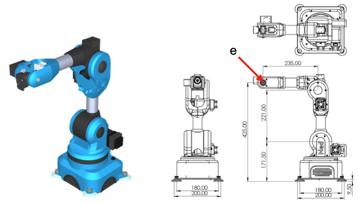
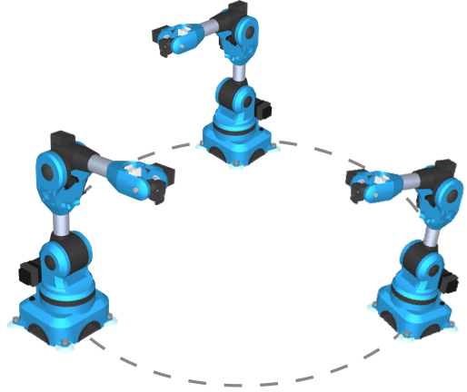

### Assignment: Create an animation of a robot arm

Create an animation of the robot shown in Figure 1. The figure shows a view of the robot and a diagram of the robot’s main measurements. Your robot rendering should closely resemble the one in Figure 1.



​								**Figure 1**: Robot arm and measurements. 

Use *Vedo* (`https://vedo.embl.es`) for rendering the graphics of the animation. The animation consists of three robots positioned equidistantly on a circumference. Figure 2 shows an example of the placement of the robots for the animation. You will select the radius of the circle that fits your animation. You will also choose the pattern of motion performed in the animation. But, you should try to move all joints of the robot arm. For the animation, the last part (i.e., the blue grasp-like attachment at the end of the arm connected to the gray cylinder) should allow for 360-degree rotation about the axis of elongation of the gray part (gray cylinder), e.g., the z-axis of the gray-cylinder part. 



**Figure 2**: Placement of the robot arms for the animation. Three robots placed at equidistant points along a circumference. 

Write the forward-kinematics function for the robot arm following the measurements shown in the diagram in Figure 1. Adapt the forward-kinematics function that you wrote for your previous animation assignment. In the code, construct the robot arm as a Python class that you can then use to create multiple instances of the robot arm. To create the scene, simply instantiate the robot-arm objects from the robot-arm class and position them where you want they to be located, e.g.: 

```python
# Instantiating robot objects located at (xi, yi, zi)
Robot1 = robot_arm(x1, y1, z1)
Robot2 = robot_arm(x2, y2, z2)
Robot3 = robot_arm(x3, y3, z3)

# Rendering code to show Robot1, Robot2, and Robot3. 
show_scene(Robot1, Robot2, Robot3)
```

The above code is only a suggestion of how to instantiate the robot objects (assuming that you wrote the code for the `robot_arm` class). You can write your code and design your program in any way you choose. 


#### Rubric:

##### Category 1: Modeling (45 points)

1. **Geometry (15 points):**
   - Accurate representation of robot arms with three limbs and three joints each.
   - Proper proportions and limb lengths that closely resembles the example provided.
   - Consistent and symmetrical design.

2. **Scene Composition (15 points):**
   - Equidistant positioning of the three robot arms along a circumference.
   - Consideration of overall scene balance and aesthetics (i.e., does it look nice?)

3. **Detailing (15 points):**
   - Well-defined joints and limbs with attention to details that closely resemble the example provided. 
   - Added scene elements or features to enhance the visual appeal (e.g., base or floor surface).

##### Category 2: Shading, illumination, and texture (40 points)

4. **Lighting and shading (15 points):**
   - Appropriate placement and intensity of light sources for illumination that closely resemble the example provided.
   - Consideration of shadows and highlights to enhance depth perception.
   - Use of diffused shading to achieve a smooth and realistic appearance.

5. **Surface Texture (15 points):**
   - Application of textures to simulate materials (e.g., metal, plastic) for the robot arms.

6. **Color Palette (10 points):**
   - Thoughtful selection of colors for the robot arms and background.
   - Harmonious color scheme that complements the overall scene.

##### Category 3: Rendering quality (15 points)

7. **Rendering quality (10 points):**

- High-quality rendering with smooth and visually appealing animation results.
- Consideration of rendering settings to achieve a polished appearance.

8. **Innovation and creativity (5 points):**
   - Use of innovative rendering techniques or effects to enhance the overall presentation.
   - Demonstrates creativity in the approach to rendering.

**Total Points: 100**


