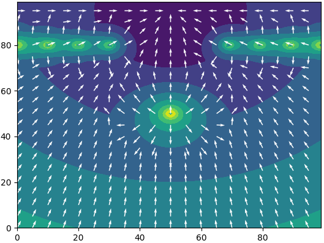
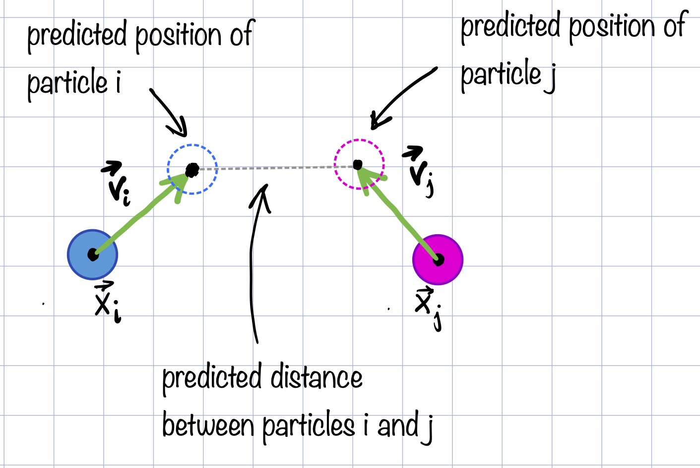
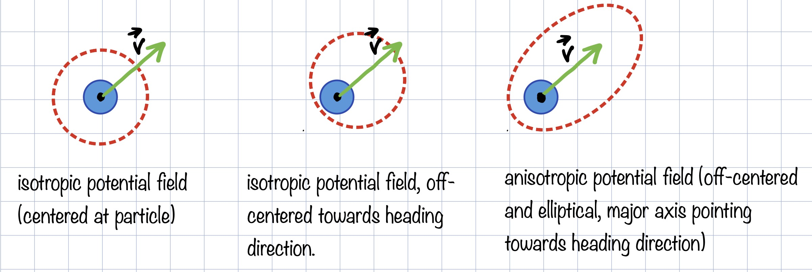

## Particle animation assignment 

In this assignment, you will use the cost-minimization approach described in the lectures to create two animations of pedestrian evacuations. 

### **Animation 1**: A group of people moving through an exit that is partially obstructed by an obstacle

The basic scenario has a group of people inside a room or more simply on one side of a wall. The wall has a door through which the group will exit to the other side of the wall. The door is partially obstructed by an object. (Figures 1 and 2).

**Figure 1**: A group meeting inside a room. 

**Figure 2**: The group evacuates the room while trying to avoid an obstacle that obstructs the exit. 

An example of the scenario is shown in the video "Le dilemme de l’évacuation" (URL: https://youtu.be/kB1XuLFzHCI?si=o3ynE6TMoJOr-ByX&t=101) from time = 1.41 minutes to 1.51 minutes.

### **Animation 2**: Merging crowds during an evacuation

In this animation, you need to create a t-shape intersection of two corridors. There will be two groups of people starting from different locations. Both groups want to reach a single goal location. The groups will merge at the t-junction of the corridors (Figure 3) and continue moving together towards the goal position. An example of the situation is shown in this video (URL: https://youtu.be/x4o7Qi45jWU).

**Figure 3**: The group evacuates from two different locations and merge at the junction between corridors. 

### **What to submit:**

- **A link to the videos of the animation: ** (e.g., Vimeo, YouTube, Google drive, Dropbox). 
- **The source code of your program**: The actual source code or Jupyter notebook. 

### **Further information**:

- You must implement your solution to the problem using the cost-minimization approach presented in class and described in [Breen's](related_materials/cost_min.pdf) paper. You can modify or extend Breen's approach but you shouldn't use any other approach from online sources to implement the solutions of this assignment. 
- The penalty cost for the walls can be created using a linear arrangement of overlapping obstacle-avoidance functions. 
- To implement the animations, you will need to design the simulation scene and maybe adapt the obstacle-avoidance penalty functions to create the avoidance function for the walls. You will also need to create dynamic obstacle-avoidance functions that will be centered at each particle so they can avoid each other as they move. 

#### Building the scene

While the calculations are mostly done in 2-D, the animation that you will create should be in 3-D using Vedo, VPython, Open3D or similar library (or API). You can use spheres to represent the moving particles, boxes to represent the walls, and cylinders to represent  obstacles. Figure 4 shows an example of a basic scene for each animation. These are just examples, you can create your own scene component for each animation. 

**Figure 4**: Top: basic scenario for animation 1. Bottom: basic scenario for animation 2. 

#### Calculating the cost function and its components 

- [How to calculate the cost function and its gradient for a single-particle motion](single_particle_animation/Implementation_details.md). 

#### Calculating the gradient of the static components of the cost function

You can pre-calculate the gradient field for the static components of the cost function. An example of a gradient for the scenario in animation 1 is shown in Figure 5. The figure shows the gradient vector field (e.g., using a quiver plot) of the cost function (overall cost, not individual components) for a sample of locations of a single particle. This specific example shows how the gradient "landscape" looks like for a single particle placed at a few critical locations along a possible path. The influence of the force fields of neighboring particles is not part of the gradient in this example. 

#### Calculating the gradient of the dynamic components of the cost function

You will need to add an extra cost term to avoid the particles colliding to one another. To visualize the influence of this cost term, you can repeat the calculation of the gradient but this time using two particles. In this case, you want to visualize the gradient vector field for situations when the particles are close enough to each other to cause "repulsion" in the (negative) gradient, and also when they are far enough to not suffer any influence from each others obstacle-avoidance term of the cost function. 

#### A more realistic “social-distance” penalty term

While the obstacle-avoidance term in the paper works for pedestrian simulations. A more realistic "social-distance" penalty term can be designed by combining the predicted position of a given particle with the predicted position of all other particles. The main component of this "social-distance" is the distance between the predicted position of the particle (i.e., at time t+1) and the predicted distance of the other particles (at time t+1). Here, "Predicted" means future position. This distance is given in Slide 8 of my lecture slides on path planning. To create the social-force term of the cost function, you can use the same obstacle avoidance function you use for the objects and pedestrians. You will need to think on how to modify that equation or adapt it.

Another upgrade to the social-distance cost can be achieved by making it biased towards the "front" of the pedestrian instead of being centered at the pedestrian. This modified social-distance cost is shifted in the direction the pedestrian is facing (i.e., the heading direction). The desired effect is for pedestrians to be less affected by the social-distance term if they are walking in the same direction. It should in principle also allow them to be closer to one another if they are facing the same direction as they move towards the same goal position. 

### **The following are some relevant links:** 

- **Breen's paper**: [cost_min.compressed.pdf](related_materials/cost_min.pdf)
- **Lecture slides**: [Download 07pathplanning.pdf](related_materials/07pathplanning.pdf)

#### **Interesting videos of pedestrian simulation:** 

- Stadium evacuation: https://youtu.be/4AZQ4lFLcb4 
- Lane formation in counter flow: https://youtu.be/J4J__lOOV2E 
- Exit choice in an evacuation: https://youtu.be/cGJ0NT_Bg4g 
- Merging crowds during an evacuation: https://youtu.be/x4o7Qi45jWU 

  
