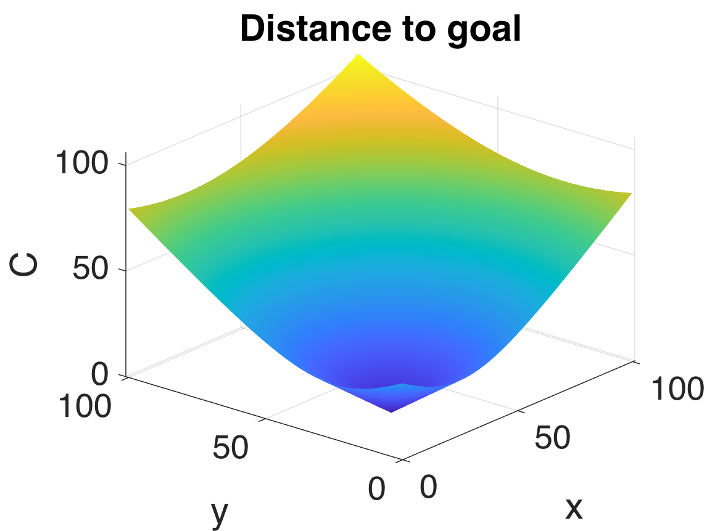
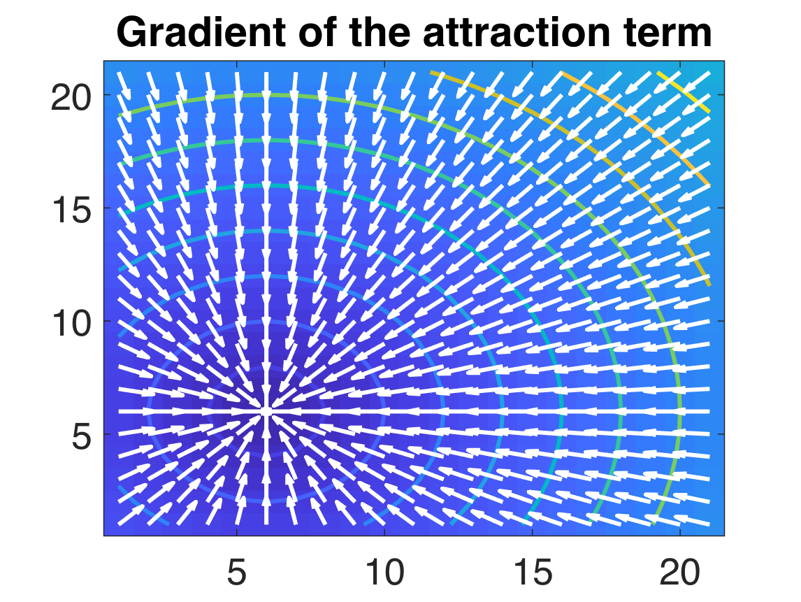
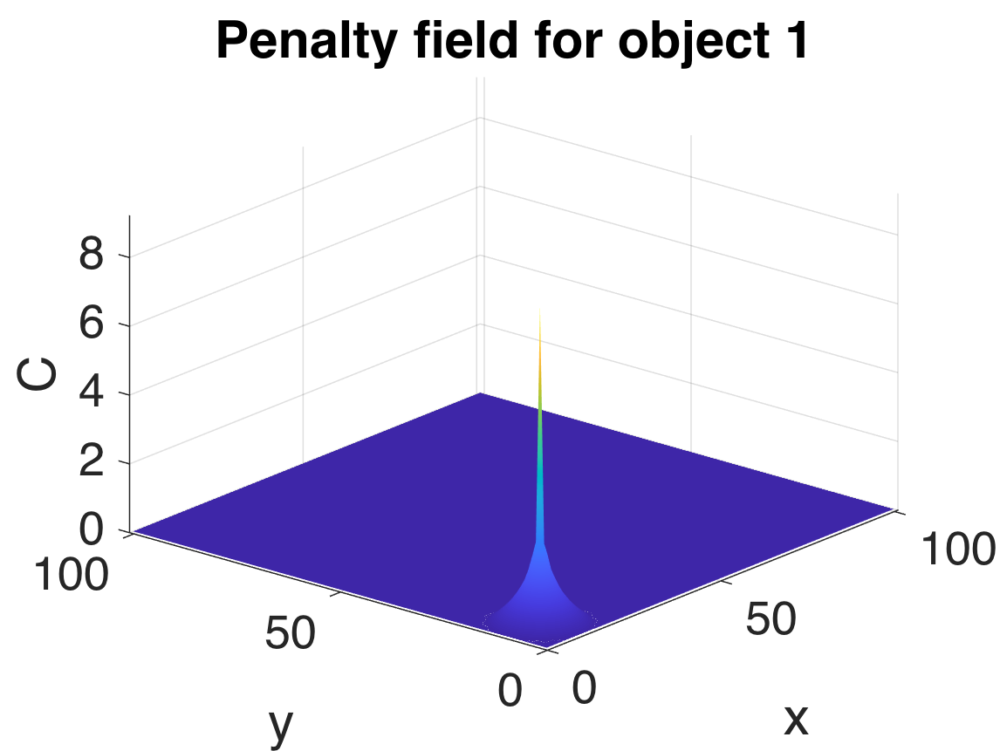
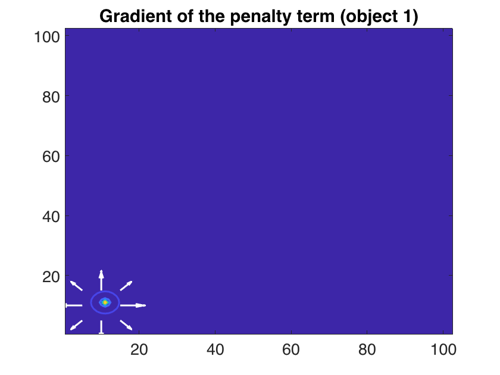
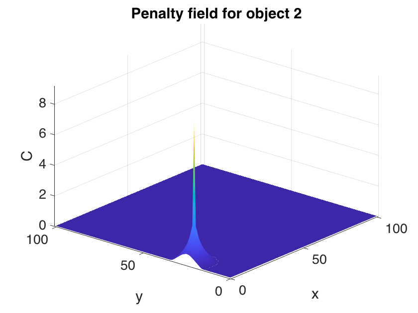
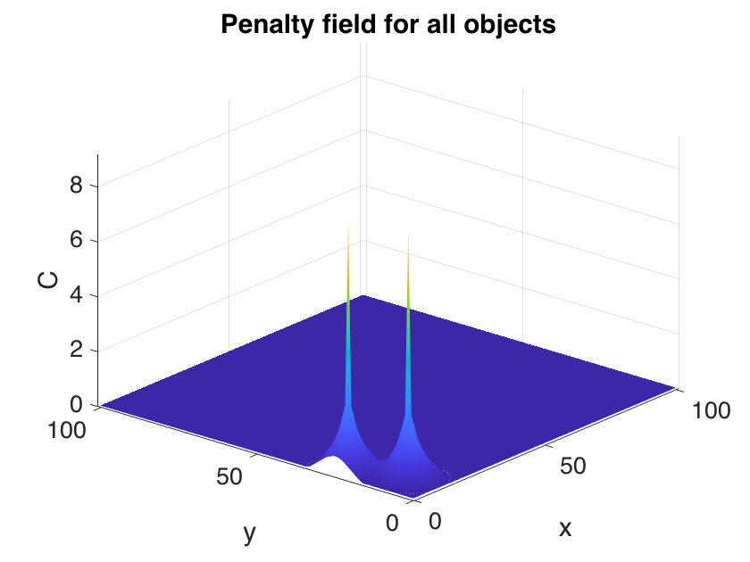
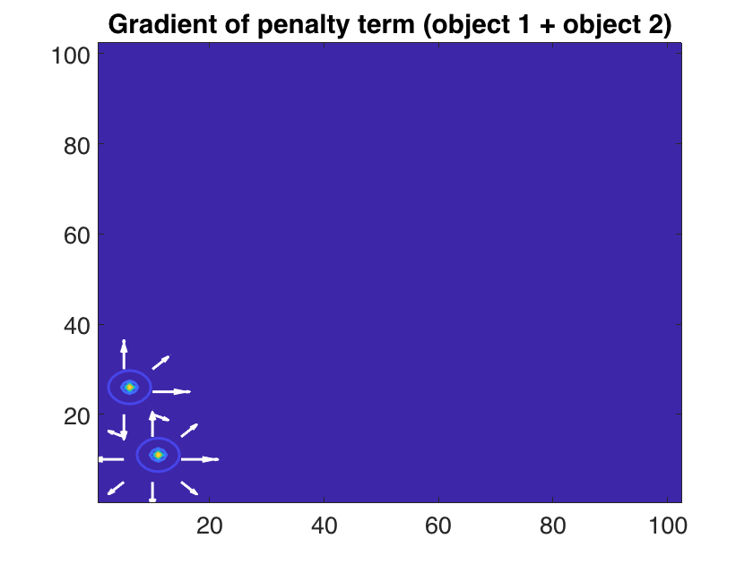
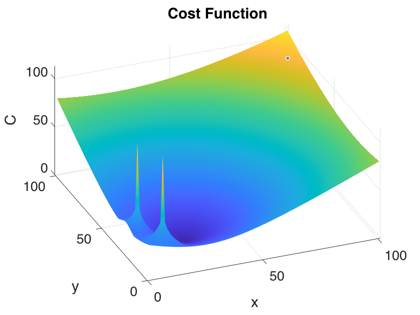
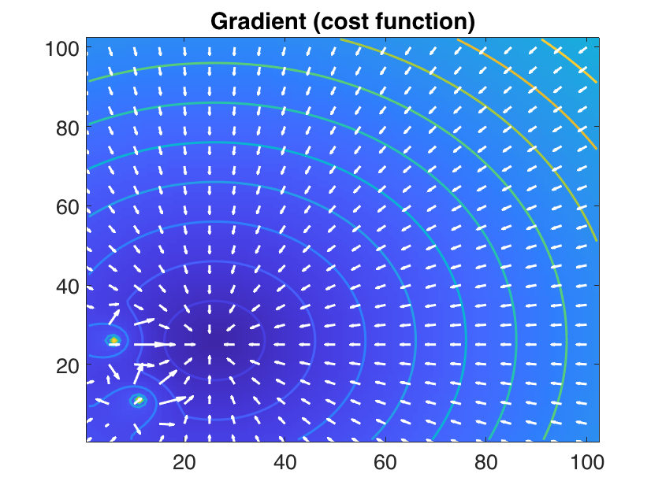

# Implementation details 


**Figure 1**: Animation of the motion of a single particle moving through a set of obstacles.


The animation is achieved by minimizing the following cost function: 

$$
\begin{align}
	C\left({\bf x}\right) = \|{\bf x} - {\bf g}\| + \sum_{i=1}^{n} \mathcal{F}\left(\|{\bf x} - {\bf o}_i\|\right), 
	\label{costFunction}
\end{align}
$$

where ${\bf x}$ is the current location of the animated object, ${\bf g}$ is the goal location, ${\bf o}_i$ is the location of obstacle $i$, and $\mathcal{F}$ is a penalty field for collision avoidance. The penalty field $\mathcal{F}$ is given by: 

$$
\begin{align}
        \mathcal{F}\left(d\right) = 
	\begin{cases}
		\ln\left(R/d\right), & 0 < d \leq R,\\
		0,                         &d > R.
	\end{cases}
	\label{field_function1}
\end{align}
$$

where $R$ is the radius of the obstacle. 

When designing the animation, we need to set the value of the goal location ${\bf g}$, the radius of the obstacles, $R_i$, and their location ${\bf o}_i$. 

#### Example of cost function 

One way to implement the cost function is to consider each component of Equation $\ref{costFunction}$ separately. This approach helps us understand how each component affects the overall cost and also illustrates the interplay between the various components as the moving particle changes position. 

##### The attraction term

Let's start with the implementation of the first attraction term in Equation $\ref{costFunction}$. Here, we will try to use vectorized calculations instead of loop as often as possible. Vectorized calculations are more computationally efficient and yield cleaner code than loops. This can be done by creating a grid of points (i.e., the domain of the function) describing all possible locations of the particle and then calculating the cost at every position of the grid. 

Create a grid to represent the spatial landscape. This landscape is the spatial domain of the cost function: 

```matlab
[X,Y] = meshgrid(0:1:100,0:1:100);
```

Then, create another grid, where each position has coordinates of the goal location. Here, the goal location is ${\bf g}=\left(25,25\right)^\mathsf{T}$, i.e.: 

```matlab
% Goal location 
g = [ 25, 25 ]';

% Copy the initial grid and set the grid points to the location of the goal
Gx = X; Gy = Y;
Gx(:,:) = g(1);
Gy(:,:) = g(2);
```

Now, calculate the "attraction" term of the cost function, i.e., the Euclidean distance between the a (potential) location of the particle and the location of the goal: 

```matlab
% Attraction term (i.e., distance to goal). This is the distance to the
% goal (d) (the whole grid at once)
C1 = sqrt( (X - Gx).^2 + (Y - Gy).^2 ); 
```

This calculation yields a matrix as a result, which can be plotted as a height function or surface, i.e.:

```matlab
displaySurfPlot(C1, 'Distance to goal', Xdim, Ydim);
```




##### The gradient of the attraction term

Now that we calculated the attraction term of the cost function at all locations, we can calculate its gradient, i.e.:

```matlab
% Calculate the gradient on a sample of the grid
CSample = C1(1:5:end,1:5:end);
[DX,DY] = gradient(CSample); 
```

In code listed above, the gradient is being calculated on a sample of the cost function values and not on the whole cost function. 

```matlab
% Calculate the gradient of cost of reaching the goal (no obstacles)
[DX,DY] = gradient(C1); 

% Create a sample grid to display arrows spaced 
delta = 5;
[X1,Y1] = meshgrid(0:delta:Xdim,0:delta:Ydim);

displaySampledGradient(X1, Y1, DX(1:delta:end,1:delta:end), DY(1:delta:end,1:delta:end), C1, 'Gradient of the attraction term','w');
```



##### The obstacle-avoidance term 1

To implement the obstacle-avoidance function, we just write Equation $\ref{field_function1}$ directly as follows: 

```matlab
% Field (penalty) function for collision-free motion
function f = F(d, R)
    %
    %   d: distance value > 0
    %   R: radius of influence >0
    %
    
    % If 0 < d <= R then f = ln(R/d)
    idx = d==0;
    d(idx) = .001;
    f = log( R ./ d );

    % If d > R then f(d) = 0
    f(d>R) = 0;
end
```

With the implementation of the penalty term at hand, we can calculate its value at each location of the same grid we used for the cost function's attraction term. If we set $R = 10$, and the location of an obstacle ${\bf o}_1 = \left(10,10\right)^\mathsf{T}$ then we can create a similar grid of locations as we did for the attraction term, i.e.:

```matlab
R = 10;                      % Obstacle radius

% Obstacle-avoidance pernaly term (i.e., distance to obstacle)
o = [ 10, 10 ]';

Ox = X; Oy = Y;
Ox(:,:) = o(1);
Oy(:,:) = o(2);

% Distance to the goal (d) (the whole grid at once)
d2 = sqrt( (X - Ox).^2 + (Y - Oy).^2 );   

% Calculate cost term 
C2 = F( d2, R );             % Field function

% Show cost as a surface 
displaySurfPlot(C2, 'Penalty field for object 1', Xdim, Ydim);
```

The value of $\mathcal{F}$ decreases as the distance $d$ increases (i.e., how far the particle is to the obstacle). Once the distance is larger than $R$, the value of the function vanishes and so does influence of this specific obstacle in the overall cost calculated by Equation $\ref{costFunction}$.  




##### The gradient of the obstacle-avoidance term 1

```matlab
% Calculate the gradient of cost of reaching the goal (no obstacles)
[DX,DY] = gradient(C2); 

% Create a sample grid to display arrows spaced 
delta = 5;
[X1,Y1] = meshgrid(0:delta:Xdim,0:delta:Ydim);

displaySampledGradient(X1, Y1, DX(1:delta:end,1:delta:end), DY(1:delta:end,1:delta:end), C2, 'Gradient of the penalty term (object 1)','w');
```



##### The obstacle-avoidance term 2

```matlab
% Obstacle-avoidance pernaly term (i.e., distance to obstacle)
o = [ 5, 25 ]';

Ox = X; Oy = Y;
Ox(:,:) = o(1);
Oy(:,:) = o(2);

% Distance to the goal (d) (the whole grid at once)
d = sqrt( (X - Ox).^2 + (Y - Oy).^2 );   

% Calculate cost term 
C3 = F( d, R );             % Field function

% Show cost as a surface 
displaySurfPlot(C3, 'Penalty field for object 2', Xdim, Ydim);
```



##### Combined penalty terms for all objects

```matlab
CAllObstacles = (C2 + C3);

% Show cost as a surface 
displaySurfPlot(CAllObstacles, 'Penalty field for all objects', Xdim, Ydim);
```



##### Gradient of the combined penalty terms for all objects

```matlab
% Calculate the gradient of cost of reaching the goal (no obstacles)
[DX,DY] = gradient(CAllObstacles); 

% Create a sample grid to display arrows spaced 
delta = 5;
[X1,Y1] = meshgrid(0:delta:Xdim,0:delta:Ydim);

displaySampledGradient(X1, Y1, ...
    DX(1:delta:end,1:delta:end), DY(1:delta:end,1:delta:end),...
    CAllObstacles, 'Gradient of penalty term (object 1 + object 2)','w');
```



##### The whole cost function

The whole cost function is simply the sum of all costs just as described in Equation $\ref{costFunction}$, i.e.:

```matlab
C = C1 + 10*CAllObstacles;   % The whole cost of moving on the landscape to reach the goal location

% Show cost as a surface 
displaySurfPlot(C, 'Cost Function', Xdim, Ydim);
```



For this plot, the obstacles' cost has been magnified by a factor of 10 for visualization purposes. 

##### The gradient of the whole cost function

```matlab
% Calculate the gradient of cost of reaching the goal (no obstacles)
[DX,DY] = gradient(C); 

% Create a sample grid to display arrows spaced 
delta = 5;
[X1,Y1] = meshgrid(0:delta:Xdim,0:delta:Ydim);

displaySampledGradient(X1, Y1, ...
    DX(1:delta:end,1:delta:end), DY(1:delta:end,1:delta:end), ...
    C, 'Gradient (cost function)','w');
```



##### Functions that generated the plots in these notes

```matlab
function displaySurfPlot(C, plotTitle, Xmax, Ymax)
    figure;
    surf(C,'FaceColor','interp',...
        'EdgeColor','none',...
        'FaceLighting','gouraud')
    axis tight
    view(-50,30)
    xlabel('x','FontSize',18)
    ylabel('y','FontSize',18)
    zlabel('C','FontSize',18)
    set(gca, 'FontSize',18);
    xlim([0 Xmax]);
    ylim([0 Ymax]);
    set(gcf, 'color','w');
    title(plotTitle);
end
```


```matlab
function displaySampledGradient(X1, Y1, DX, DY, C, plotTitle, arrowColor)
    figure; set(gcf,'color','w');
    image(C); axis xy;
    hold on;
    contour(C,'linewidth',2)
    hold on
    quiver(X1, Y1, -DX,-DY,'linewidth',2,'color',arrowColor)
    title(plotTitle);
    set(gca, 'FontSize',18);
    hold off
end
```


- [Matlab code that generates the plots shown in this text](demo_costFunctionComponents.mlx).
